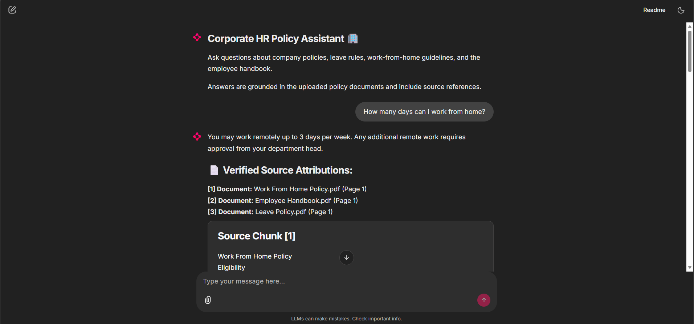
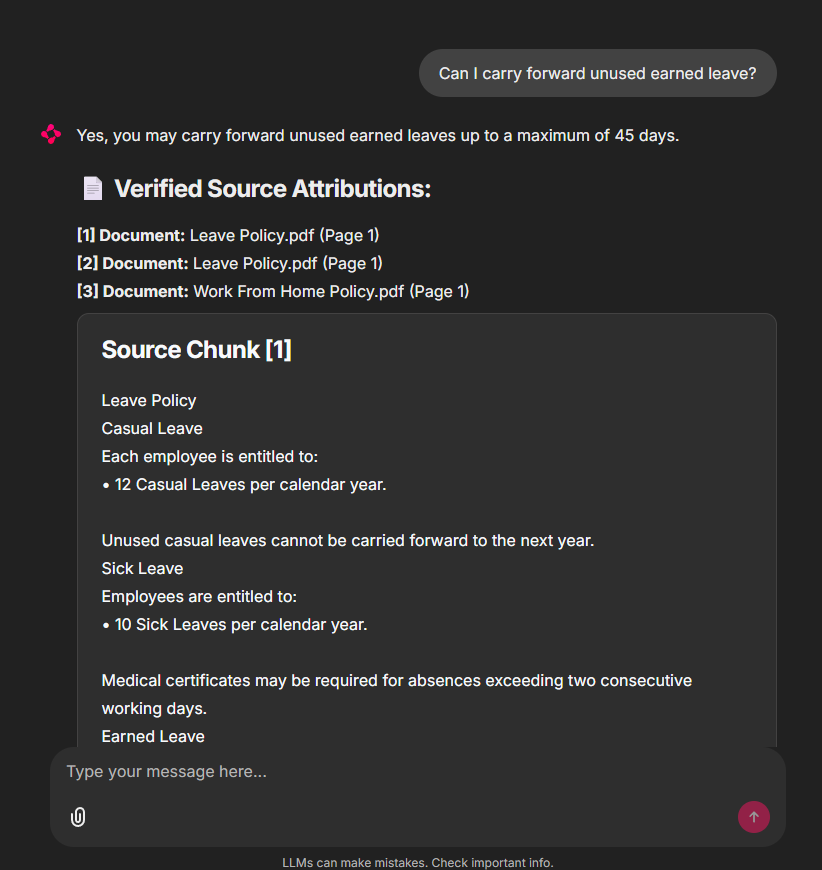
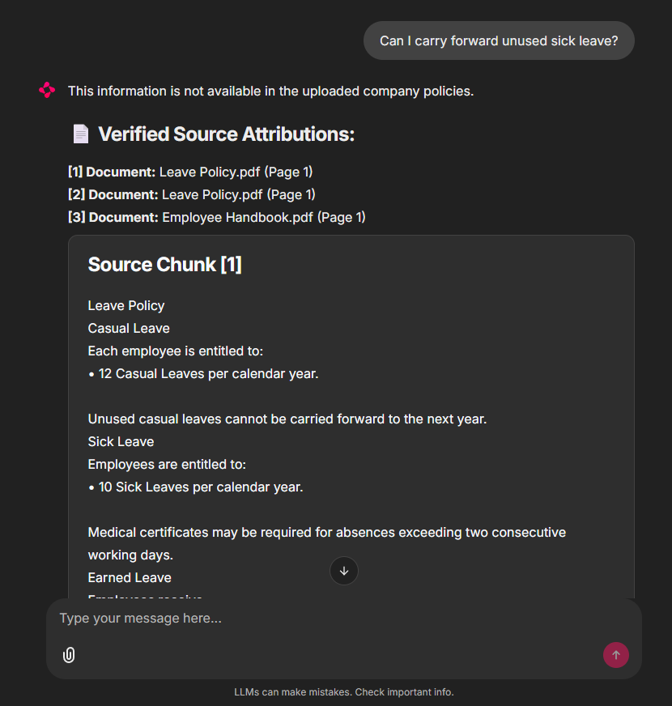
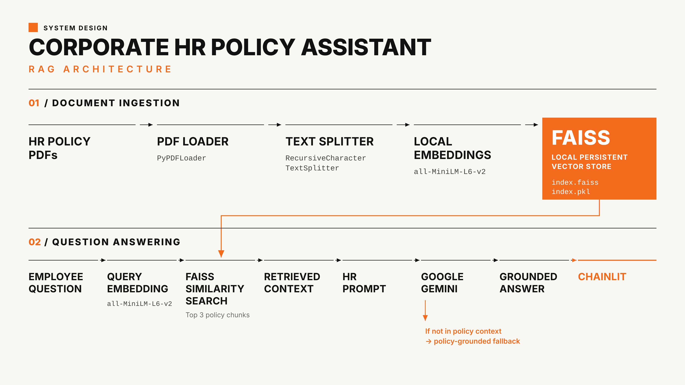

# Corporate HR Policy Assistant

A policy-grounded AI assistant that answers employee questions using
internal HR policy documents.

The application uses Retrieval-Augmented Generation (RAG) to retrieve
relevant policy content from a local FAISS vector store and uses Google
Gemini to generate the final response.

The system is designed to answer only from the provided policy
documents. When the required information is not available in the
policies, it explicitly states that instead of making an assumption.

------------------------------------------------------------------------

## Demo

### Chat Interface



### Grounded Answer with Source Attribution



### Unsupported Query Handling



------------------------------------------------------------------------

## System Architecture



The pipeline follows this RAG workflow:

1.  Employee submits a question.
2.  The question is processed using the local embedding model.
3.  FAISS retrieves the most relevant policy chunks.
4.  Retrieved content is passed to the RAG prompt.
5.  Google Gemini generates an answer using the retrieved context.
6.  The application displays the answer along with document and page
    references.

------------------------------------------------------------------------

## Key Features

-   PDF-based HR policy ingestion
-   Semantic search using FAISS
-   Local HuggingFace embeddings
-   Google Gemini for response generation
-   Top-3 relevant policy chunk retrieval
-   Source document and page attribution
-   Strict policy-grounded prompting
-   Explicit fallback when information is unavailable
-   Chainlit conversational interface
-   Persistent local FAISS vector index

------------------------------------------------------------------------

## Example

### Policy-grounded question

**Question**

> Can I carry forward unused earned leave?

**Answer**

> Yes. Unused Earned Leave can be carried forward up to a maximum of 45
> days.

The response also displays the relevant policy document and page
reference.

### Information not available in policy

**Question**

> Can I carry forward unused sick leave?

**Answer**

> This information is not available in the uploaded company policies.

The assistant does not infer the answer from general HR practices
because the uploaded policy does not specify a sick-leave carry-forward
rule.

------------------------------------------------------------------------

## Policy Documents

The demo currently uses three HR policy documents:

  -----------------------------------------------------------------------
  Document                            Covers
  ----------------------------------- -----------------------------------
  `Company Employee Handbook.pdf`     Working hours, attendance, dress
                                      code, workplace conduct and company
                                      assets

  `Leave Policy.pdf`                  Casual, sick, earned, maternity and
                                      paternity leave

  `Work From Home Policy.pdf`         WFH eligibility, weekly limits,
                                      availability and security
                                      requirements
  -----------------------------------------------------------------------

These documents are sample policies created for demonstrating the RAG
workflow.

------------------------------------------------------------------------

## How the RAG Pipeline Works

### 1. Document Loading

PDF files from the `policies/` directory are loaded using `PyPDFLoader`.

Each page is converted into a LangChain `Document` while preserving
source metadata such as the document name and page number.

### 2. Text Splitting

The extracted content is divided into smaller overlapping chunks using
`RecursiveCharacterTextSplitter`.

Current configuration:

-   Chunk size: 800 characters
-   Chunk overlap: 150 characters

### 3. Embedding Generation

Each document chunk is converted into a vector using a local HuggingFace
embedding model.

Default model:

``` text
all-MiniLM-L6-v2
```

The embedding model runs locally on CPU.

### 4. FAISS Vector Store

The generated embeddings are stored in a local FAISS index.

The index is persisted as:

``` text
faiss_index/
├── index.faiss
└── index.pkl
```

If an existing index is available, the application loads it instead of
rebuilding the knowledge base.

### 5. Retrieval

When an employee asks a question, FAISS retrieves the three most
relevant policy chunks.

### 6. Grounded Generation

The retrieved policy content is passed to Google Gemini through a strict
HR prompt.

The model is instructed to:

-   Use only the provided policy context
-   Avoid assumptions
-   Avoid inventing company rules
-   Return a specific fallback response when the required information is
    unavailable

### 7. Source Attribution

The retrieved chunks are displayed along with:

-   Document name
-   Page number
-   Retrieved source content

This allows the user to verify where the answer came from.

------------------------------------------------------------------------

## Tech Stack

  Component                Technology
  ------------------------ -----------------------------------
  Programming Language     Python
  User Interface           Chainlit
  LLM                      Google Gemini
  LLM Framework            LangChain
  Embeddings               HuggingFace Sentence Transformers
  Vector Store             FAISS
  PDF Processing           PyPDF
  Environment Management   python-dotenv

------------------------------------------------------------------------

## Project Structure

``` text
corporate-hr-policy-assistant/
│
├── app.py
├── chainlit.md
├── requirements.txt
├── .env.example
├── .gitignore
├── README.md
│
├── policies/
│   ├── Company Employee Handbook.pdf
│   ├── Leave Policy.pdf
│   └── Work From Home Policy.pdf
│
├── screenshots/
│   ├── architecture.png
│   ├── chat-interface.png
│   ├── grounded-answer.png
│   └── unsupported-query.png
│
├── faiss_index/
│   ├── index.faiss
│   └── index.pkl
│
├── src/
│   ├── __init__.py
│   ├── chatbot/
│   ├── config/
│   ├── embeddings/
│   ├── loaders/
│   ├── processors/
│   ├── prompts/
│   └── vectorstore/
│
└── .chainlit/
    └── config.toml
```

------------------------------------------------------------------------

## Getting Started

### Prerequisites

-   Python 3.10+
-   Google Gemini API key
-   Git

### 1. Clone the repository

``` bash
git clone https://github.com/YOUR_USERNAME/corporate-hr-policy-assistant.git
cd corporate-hr-policy-assistant
```

### 2. Create a virtual environment

#### Windows

``` bash
python -m venv .venv
.venv\Scripts\activate
```

#### Linux / macOS

``` bash
python -m venv .venv
source .venv/bin/activate
```

### 3. Install dependencies

``` bash
pip install -r requirements.txt
```

### 4. Configure environment variables

Create a `.env` file in the project root:

``` env
GOOGLE_API_KEY=your_google_api_key
MODEL_NAME=gemini-3.1-flash-lite
EMBEDDING_MODEL_NAME=all-MiniLM-L6-v2
```

A template is provided in `.env.example`.

Do not commit your actual `.env` file.

### 5. Run the application

``` bash
chainlit run app.py
```

The Chainlit interface will open in your browser.

------------------------------------------------------------------------

## Adding or Updating Policies

Place new PDF policy documents inside:

``` text
policies/
```

If the policy collection changes, remove the existing FAISS index so the
application can rebuild it from the updated documents.

Remove:

``` text
faiss_index/index.faiss
faiss_index/index.pkl
```

Then start the application again:

``` bash
chainlit run app.py
```

The application will load the available PDFs, split their content,
generate embeddings and create a new FAISS index.

------------------------------------------------------------------------

## Grounding Behavior

This project intentionally prioritizes grounded answers over attempting
to answer every question.

For example, the Leave Policy explicitly states that unused Earned Leave
can be carried forward up to 45 days.

Therefore, the assistant can answer:

> Can I carry forward unused earned leave?

However, if the uploaded policy documents do not specify whether unused
Sick Leave can be carried forward, the assistant does not assume that
the rule exists.

Instead, it returns:

> This information is not available in the uploaded company policies.

This behavior is important for policy-based applications where an
invented answer could lead to an incorrect employee decision.

------------------------------------------------------------------------

## Current Limitations

-   The system currently accepts PDF policy documents.
-   Answers are limited to information contained in the uploaded
    policies.
-   Policy changes require rebuilding the FAISS index.
-   The vector store is local and currently uses FAISS.
-   There is no employee authentication or role-based access control.
-   The sample policy documents are created for demonstration purposes.
-   Retrieval quality depends on the quality and structure of the source
    documents.

------------------------------------------------------------------------

## Possible Future Improvements

-   Hybrid keyword + semantic retrieval
-   Retrieval reranking
-   Policy version management
-   Automatic index rebuilding
-   Employee authentication and role-based access
-   Admin interface for uploading and managing policies
-   Conversation history
-   Automated RAG evaluation
-   Retrieval precision and answer-grounding metrics
-   Support for larger enterprise document collections
-   Hosted vector database for scalable deployment

------------------------------------------------------------------------

## Requirements

The project uses pinned versions of its primary dependencies for
reproducibility.

``` text
chainlit==2.12.0
langchain==1.4.3
langchain-community==0.4.2
langchain-google-genai==4.4.0
langchain-huggingface==1.2.2
langchain-text-splitters==1.1.3
faiss-cpu==1.15.1
sentence-transformers==6.1.0
pypdf==6.19.0
python-dotenv==1.2.4
```

------------------------------------------------------------------------

## License

This project is intended for educational, portfolio and demonstration
purposes.
